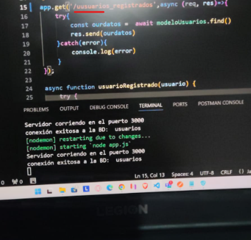
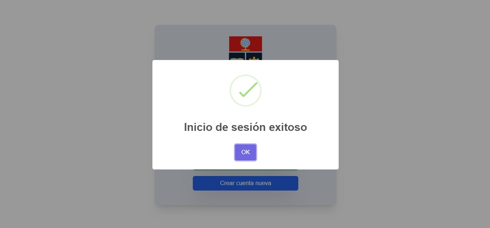
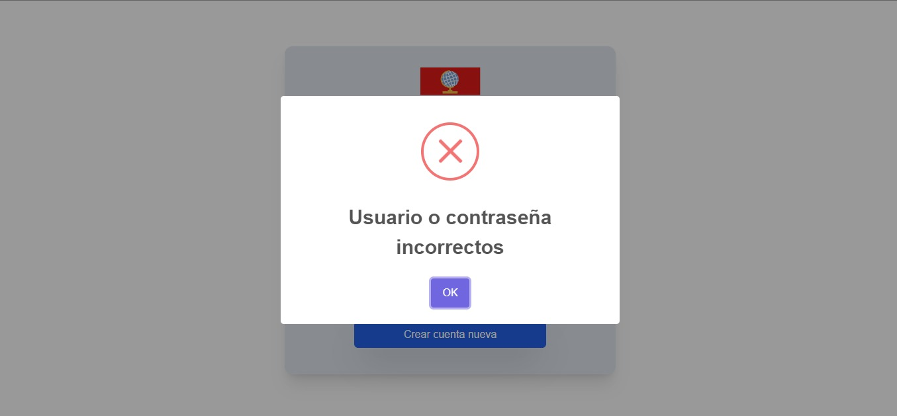
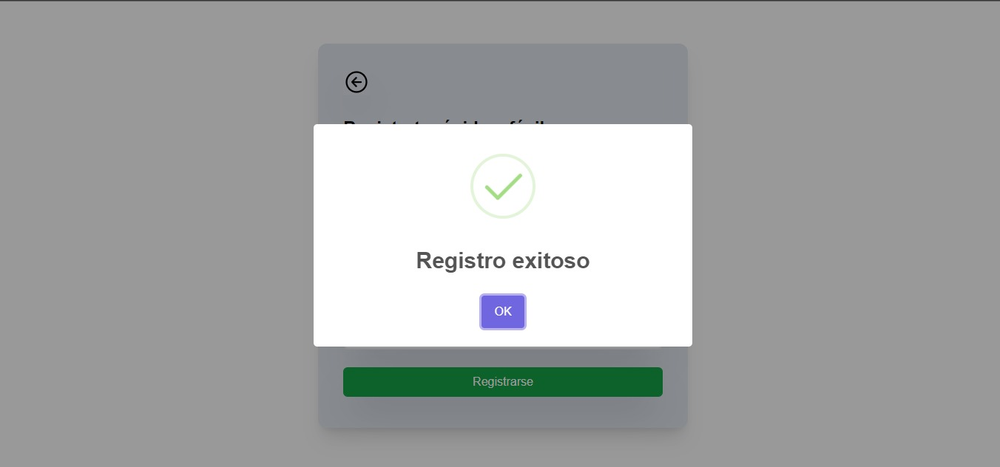
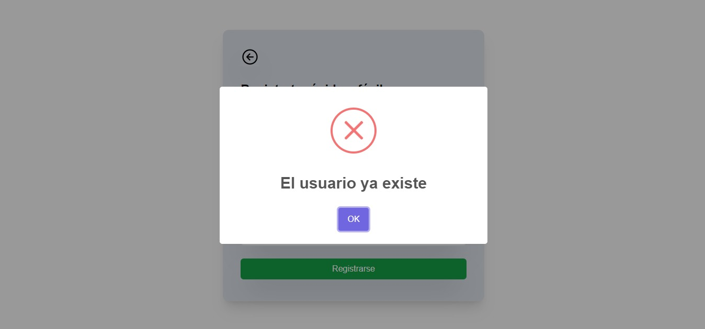

# ESCUELA POLITÉCNICA NACIONAL
## GRUPO 1: 
#### Britanny Flores, Johan Mantilla, Carlos Landázuri, Erick Cabezas, Kevin Cano

#### Fecha: 22/05/2024 
## Tema:  Taller - Falla, defecto y error 

Primero daremos paso a una breve descripción sobre la falla, defecto y error. Luego, con capturas se mostrara como hemos implementado la falla, el defecto y el error.

#### Falla:
La falla hace referencia cuando hay un defecto, este se hace evidente en la ejecución.

#### Defecto:
El defecto hace referencia a que si realiza una acción pero con problemas

#### Error:
Los errores vienen a ser defectos humanos como digitar mal un nombre, recordemos que un error puede conducir a una falla

Ahora con esta breve introducción a los conceptos, se mencionara con capturas como se aplico cada uno de estos puntos en la tarea.

## 1. Error
Como se menciono previamente un error hace referencia a los errores humanos, en este caso el error humano esta en la ruta de la solicitud "get" del backend.

Se encuentra el error "/uusuario" que es un error que cometio el programador al llamar a la pantalla usuario

## 2. Defecto
Cuando el usuario se logea, sale  que el logueo es correcto aunque ingrese incorrectamente las credenciales de acceso. El defecto sería que el sistema permite el inicio de sesión incluso cuando las credenciales son incorrectas.
el defecto sería que el sistema permite el inicio de sesión incluso cuando las credenciales son incorrectas. El usuario si inicia sesión pero no de la forma correcta

En realidad deberia salir lo siguiente

El otro defecto esta en el registro, si el usuario llena los campos de registro y clickea en registrarse, pero apesar de estar registrado le aparece un mensaje de usuario registrado en lugar de no permitirle tal acción. El usuario se registra pero no de la forma correcta.

Cuando en realidad debería aparecer así porque no deberia registrar un usuario ya registrado.

## 3. Falla 

Tomando los dos defectos, no nos olvidemos que la falla se muestra en tiempo de ejecución a raiz del defecto.

Primer fallo es que el usuario se haya podido Loguear correctamente, el mensaje de "Logueo correcto" también es una falla. Lo ideal seria controlar este tipo de situaciones con excepciones y con bases de datos.

Segunda falla, el usuario pudo registrarse correctamente aunque se ha registrado previamente, no existio ningun control para evitar aquello, esto producira una redundancia grande. Lo ideal seria mantener algun control en la insersión de registros de la base de datos. Adicionalmente, el mensaje que va de la mano con el registro es incorrecto.
